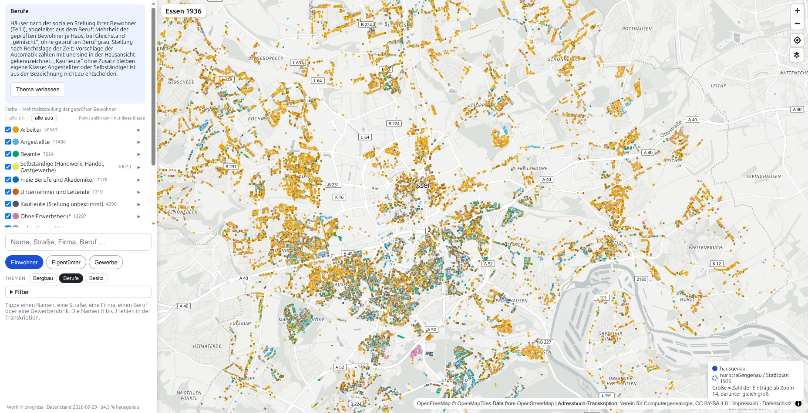
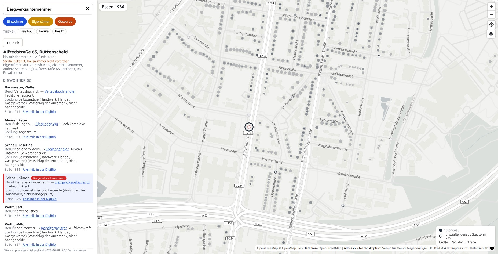

# Essen 1936 – Das Adressbuch auf der Karte

Eine interaktive Karte des Essener Adreßbuchs von 1936: Wer wohnte wo, wem
gehörten die Häuser, welche Betriebe gab es, und wie war die Stadt sozial
gegliedert. Dazu die Datenaufbereitung, mit der die Karte entsteht.

**Zur Karte: <https://rodouc6.github.io/essener-adressbuch-1936/>**

> **English abstract.** This project puts the 1936 Essen city directory
> (*Essener Adreßbuch 1936*) on a map. The transcription by the Verein für Computergenealogie
> (240,636 entries: residents, house owners, businesses) was cleaned, parsed,
> matched against the historical street register and geocoded; 93 % of the
> entries are located. The website shows every address with its residents,
> owner and businesses, colours the map by occupation, social position and
> type of owner, and tells the findings in short chapters. Automatic
> assignments are marked as such throughout. The project is work in progress.



## Worum es geht

Das *Essener Adreßbuch 1936* (Verlag August Scherl) verzeichnet in drei Teilen
die Einwohner mit Beruf und Adresse, die Häuser mit ihren Eigentümern und die
Betriebe nach Branchen. Der Verein für Computergenealogie hat das Buch in
seinem Daten-Erfassungs-System abgeschrieben und die Transkription unter
CC BY-SA 4.0 veröffentlicht.

Dieses Projekt legt die Transkription auf die heutige Stadtkarte:

- **240.636 Einträge**: 188.241 im Einwohnerverzeichnis, 33.467 im Straßen-
  und Häuserverzeichnis, 18.928 im Branchenverzeichnis
- **70.316 Adressen**, davon 93 % verortet: 64 % auf das Haus, 28 % auf die
  Straße, 1 % von Hand über den Stadtplan von 1935 (verschwundene Straßen)
- **Berufe** zu 80 % der Einträge mit einem geprüften Schlüssel der OhdAB
  (Ontologie historischer Amts- und Berufsbezeichnungen), daraus die soziale
  Stellung: Arbeiter, Angestellte, Beamte, Selbständige, Kaufleute, freie
  Berufe, Unternehmer, ohne Erwerbsberuf
- **Eigentümer** zu 64.439 Adressen mit Kategorie (Privatperson, Bergbau,
  Industrie, Stadt/Staat, Genossenschaft, Kirche/Stiftung …); alle
  Körperschaften ab fünf Häusern von Hand geprüft
- **Betriebe** zu 18.016 verorteten Einträgen mit Branche
- **18 Zechen**, deren Betrieb 1936 belegt ist

Die Karte bietet Suche nach Namen, Straßen, Berufen und Firmen, eine
Hausansicht mit allen Einträgen und dem Verweis auf die Seite der Vorlage,
drei Themen (Bergbau, Berufe nach Stellung, Besitz) mit ein- und
ausschaltbaren Gruppen, den Vergleich von bis zu fünf Berufen oder
Eigentümern und einen CSV-Export der Treffer. Die Seite „Schlaglichter“
erzählt in vier Kapiteln, was sich aus den Daten lesen lässt.



## Die Daten

| Datei | Inhalt |
|---|---|
| [`kuratierung/eigentuemer.csv`](kuratierung/eigentuemer.csv) | Eigentümer-Schreibweisen zusammengeführt, Kategorie je Eigentümer, Prüfstatus |
| [`kuratierung/berufe.csv`](kuratierung/berufe.csv) | Berufs-Schreibweisen mit OhdAB-Schlüssel, sozialer Stellung und Prüfstatus |
| [`kuratierung/gewerbe.csv`](kuratierung/gewerbe.csv) | Rubriken des Branchenverzeichnisses mit Branche und Betriebsform |
| [`kuratierung/zechen.csv`](kuratierung/zechen.csv) | Zechen mit Lage, Betriebsjahren und geprüftem Status 1936 |
| [`kuratierung/zeilenkorrekturen.csv`](kuratierung/zeilenkorrekturen.csv) | jede Berichtigung an der Transkription, einzeln begründet |
| `site/daten/` | das Datenpaket der Karte (278 MB, nicht im Repository; entsteht mit `pipeline/06_karte_export.py`) |

Die Rohdaten (`data/essen1936.csv`) liegen nicht im Repository. Es ist die
unveränderte Datei aus dem Datensatz „Historische Adressbücher aus dem
Rheinland und Ruhrgebiet“ (Coding da Vinci 2021); Herkunft und Prüfsumme
stehen in [`docs/datenquelle_lizenz.md`](docs/datenquelle_lizenz.md).

> **Achtung beim Zählen.** Das Einwohnerverzeichnis nennt Haushaltsvorstände
> und Personen mit eigenem Eintrag, nicht die Bevölkerung. Ehefrauen ohne
> eigenen Eintrag, Kinder und Untermieter fehlen. Die Nachnamen H bis J
> (Seiten 186–258, geschätzt 23.000 Personen) fehlen in der Transkription.

## Vom Buch zur Karte

```
  Transkription (CompGen, DES-Projekt essen1936)      data/essen1936.csv
        │
        ▼  01 einlesen, Zeilen bereinigen        ◄── kuratierung/zeilenkorrekturen.csv
        ▼  02 Adresse zerlegen (Straße, Nummer, Etage, Stand)
        ▼  03 Straße von 1936 auf heute auflösen  ◄── Essener Straßenverzeichnis (Zenodo)
        ▼  04 geokodieren (Nominatim, eigene Instanz)
        ▼  05 Bericht und Stichproben
        ▼  06 Datenpaket der Karte               ◄── kuratierung/ (Eigentümer, Berufe, Gewerbe, Zechen, Themen, Kapitel)
        │
        ▼
  site/  Karte (MapLibre GL, PMTiles), Schlaglichter, Hausansicht – statisch, ohne Server
```

1. **Bereinigen.** Zeilen der Transkription, die offensichtlich verrutscht
   oder verlesen sind, werden nicht in der Quelle geändert, sondern in
   `zeilenkorrekturen.csv` mit altem Wert und Begründung festgehalten.
2. **Auflösen.** Die Straßennamen von 1936, darunter viele Umbenennungen der
   NS-Zeit, werden über den eigenen Datensatz
   [Essener Straßenverzeichnis](https://doi.org/10.5281/zenodo.22757900) auf
   die heutigen Namen abgebildet.
3. **Verorten.** Heutige Adressen werden einmalig geokodiert. Jede Adresse
   trägt ihre Präzision: hausgenau, straßengenau oder Stadtplan 1935.
   Eine Stichprobe von 200 hausgenauen Adressen ergab 194 richtige und 6
   unklare Punkte ([`docs/stichprobe.md`](docs/stichprobe.md)).
4. **Zuordnen.** Berufe, Eigentümer und Gewerberubriken bekommen Schlüssel
   und Kategorien. Ein Programm schlägt vor, entschieden wird nach
   dokumentierten Regeln und, bei den großen Gruppen, von Hand. Was nicht
   von Hand geprüft ist, bleibt auf der Karte und in den Kapiteln als
   Vorschlag gekennzeichnet. Bei den mittleren Gewerberubriken hat ein
   Sprachmodell nach festgehaltenen Prinzipien entschieden
   ([`docs/gewerbe.md`](docs/gewerbe.md)).
5. **Zeigen.** Die Website ist statisch: HTML, CSS und JavaScript-Module ohne
   Bundler, MapLibre GL und PMTiles für die Karte, scrollama für die Kapitel.

## Grenzen der Daten

- **Das Adressbuch ist eine Auswahl.** Es nennt, wer 1936 einen Eintrag
  hatte: überwiegend männliche Haushaltsvorstände, Frauen meist nur als
  Witwen oder mit eigenem Haushalt. Wer nicht mehr verzeichnet war, fehlt.
- **1936 ist das dritte Jahr der NS-Herrschaft.** Straßennamen wie
  „Adolf-Hitler-Straße“ stehen so in der Quelle; die Karte zeigt sie unter
  dem heutigen Namen und nennt den Namen von 1936 in der Hausansicht.
  Eine Einordnung des historischen Kontexts ist in Arbeit.
- **Heutige Geographie.** Verortet wird über heutige Straßen und
  Hausnummern; Stadtteilgrenzen und Straßenlinien sind die heutigen
  (OpenStreetMap). Umnummerierungen und Kriegszerstörungen sind nicht
  erfasst.
- **Automatische Zuordnungen** sind überall als solche markiert. Die soziale
  Stellung lehnt sich an die Berufszählung von 1933 an, weicht aber bewusst
  ab ([`docs/stellung.md`](docs/stellung.md)).
- **Der Stadtplan 1935** (Stadt Essen, Historischer Verein) wird erst als
  Kartenebene angeboten, wenn die Rechte geklärt sind.

## Aufbau des Repositorys

```
site/            Website: Karte, Schlaglichter, Über, Impressum (site/daten/ wird erzeugt)
pipeline/        Schritte 01–06 und Bibliothek (pipeline/lib/)
kuratierung/     von Hand gepflegte Tabellen: Eigentümer, Berufe, Gewerbe, Zechen, Themen, Kapitel
werkzeuge/       Prüf- und Kuratierungswerkzeuge (Browser-Editoren, Abgleiche, Deploy)
tests/           pytest; site/tests/ Node-Tests der Website
docs/            Methodik, Stichproben, Quellenbewertung, Entscheidungen
```

Reproduzieren: Python 3.12, `pip install -e .[test]`, tippecanoe für die
Kacheln; Rohdatei nach `data/essen1936.csv`; dann `python3 pipeline/01_einlesen.py`
bis `06_karte_export.py` und `python3 werkzeuge/serve.py`. Tests:
`python3 -m pytest -q` und `node --test site/tests/*.test.js`. Die ausführliche
technische Dokumentation steht in [`docs/pipeline.md`](docs/pipeline.md).

## Zitieren, Lizenz, Kontakt

**Zitieren:** Rodouniklis, Christos: Essen 1936 – Das Adressbuch auf der
Karte. Datenstand 2026-09-29. <https://rodouc6.github.io/essener-adressbuch-1936/>
(siehe auch [`CITATION.cff`](CITATION.cff)).

**Lizenz:** Der Code steht unter der MIT-Lizenz. Die Transkription und alle
daraus abgeleiteten Daten stehen unter CC BY-SA 4.0 (Verein für
Computergenealogie e. V.). Koordinaten, Stadtteilgrenzen und Straßenlinien
stammen aus OpenStreetMap (ODbL). Näheres in [`LICENSE`](LICENSE) und
[`LIZENZ-DATEN.md`](LIZENZ-DATEN.md).

**Quelle:** Essener Adreßbuch 1936. Unter Benutzung amtlicher Quellen,
Verlag August Scherl, Essen 1936. Transkription: Verein für
Computergenealogie e. V., DES-Projekt
[essen1936](https://des.genealogy.net/essen1936/).

**Kontakt:** Christos Rodouniklis, Master-Student, Bergische Universität
Wuppertal, siehe
[Impressum](https://rodouc6.github.io/essener-adressbuch-1936/impressum.html).
Hinweise auf Fehler in Einträgen oder Zuordnungen sind willkommen.
